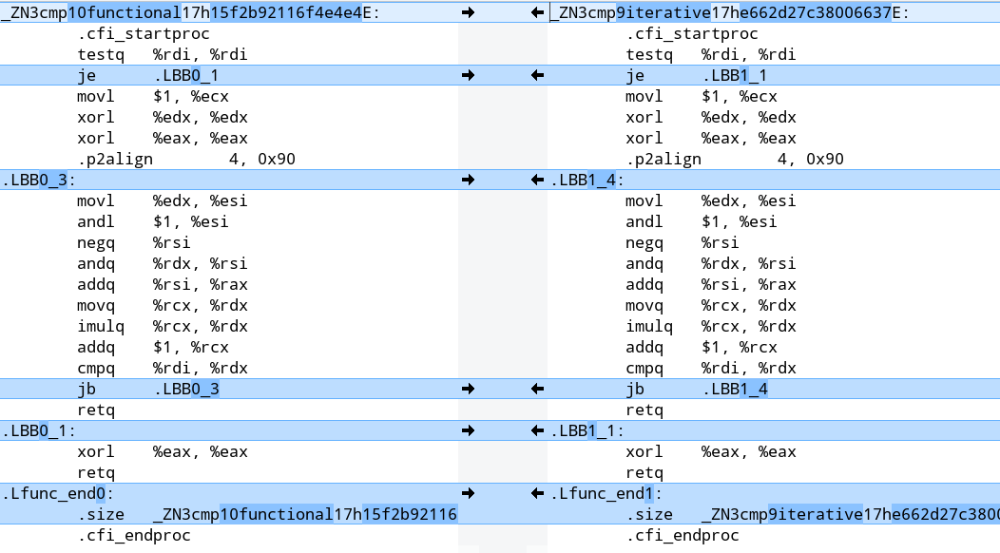

class: center, middle

## But first, any questions from last the meetup?

---

## And second, Functional vs Iterative

```Rust
// The sum of odd squares from 0 until (n*n < upper)

// Functional
let acc: u32 = (0..).map(|n| n * n)
                    .take_while(|&n| n < upper)
                    .filter(|n| is_odd(*n))
                    .sum();

// Iterative
let mut acc = 0;
for n in 0.. {
  let n_squared = n * n;
  if n_squared >= upper {
    break;
  } else if is_odd(n_squared) {
    acc += n_squared;
  }
}
```

---

## Benchmark

**`cargo bench --lib`**

```text
test tests::bench_functional ... bench:       1,074 ns/iter (+/- 150)
test tests::bench_iterative  ... bench:         360 ns/iter (+/- 14)
```

---

**`cargo rustc --release -- --emit asm`**

```assembly
_ZN1i9iterative17hd26466ad77c59d9eE:
	.cfi_startproc
	test	rdi, rdi
	je	.LBB0_1
	mov	ecx, 1
	xor	edx, edx
	xor	eax, eax
	.p2align	4, 0x90
.LBB0_4:
	mov	esi, edx
	and	esi, 1
	neg	rsi
	and	rsi, rdx
	add	rax, rsi
	mov	rdx, rcx
	imul	rdx, rcx
	add	rcx, 1
	cmp	rdx, rdi
	jb	.LBB0_4
	ret
.LBB0_1:
	xor	eax, eax
	ret
```

---

## Assembly output

.left[]

---

## Force inlining

```Rust
#[inline(always)]
fn is_odd(a: u64) -> bool {
  a % 2 != 0
}
```

---

## That's better

```text
test tests::bench_functional ... bench:         401 ns/iter (+/- 30)
test tests::bench_iterative  ... bench:         398 ns/iter (+/- 23)
```

---

## Questions?

---

class: center, middle

# Enums and Pattern Matching

James Cooper

(based on Chapter 6 of [The Book](https://doc.rust-lang.org/book/title-page.html))

---

### Enums aren't anything new! 😕

- C-style enums aren't anything new, no.
- Rust's enums aren't the same, however.
- Not just names for numbers, enums can potentially contain any types.
- Used to create an overall type for related types.

---

### A Sum Type By Any Other Name

- Rust's flavour of enums are known by various names
- F#: Discriminated Unions
- Haskell: Algebraic Data Types
- Also 'Sum Types' in mathematical terms

---

### A XOR B XOR C

- Enums are used to represent groups of types, when any given instance can be _only one_ type
- The Book gives the example of IP addresses
- An IP address can be IPv4 or IPv6, but never both at once

---

### Declaring the Gates of Babylon

- Let's declare all the colours of the rainbow 🌈

```Rust
    enum Rainbow {
        Red,
        Orange,
        Yellow,
        Green,
        Blue,
        Indigo,
        Violet
    }
```

???

The slide title is a reference to a song from the band Rainbow's 1978 album "Long Live Rock 'n' Roll".

---

### Assignation

- How to assign an instance of the enum to a variable?

```Rust
let dalaran = Rainbow::Violet;
```

- It's that simple
- Use the enum name and then the case name, separated with a double colon

???

Dalaran were the human mage nation in Warcraft 2, and their assigned colour was described as violet.

---

### But wait, there's more!

- The enum style seen so far can be quite handy, when combined with pattern matching (coming up)
- It still wouldn't _really_ be much different to C enums though
- We can, however, assign types to enum cases, e.g.

```Rust
    enum OldMacDonald {
        Goat(u8),
        Chicken(u8),
        Sheep(u8),
        Cow(u8),
        Horse(u8),
        Alpaca(u8),
    }
```

---

### eNUM

- We can 'contain' types inside our enum cases.
- How to use them?

```Rust
let g = OldMacDonald::Goat(5u8);

let mut c = OldMacDonald::Chicken(3u8);

c = OldMacDonald::Sheep(4u8);
```

- Yep, a given variable is free to change enum cases

---

### 👍🏻 for diversity

- Using an enum means that the cases are logically connected somehow, and we want to be able to move between them
- That doesn't mean they all have to be the same, however
- We can give different cases different types
- But by using the enum, we can group them all together as parts of one super-type

---

### This probably isn't the best way to do this...

- Maybe we want to store those IP addresses differently? (example from The Book)

```Rust
    enum IpAddr {
        V4(u8, u8, u8, u8),
        V6(String),
    }

    let home = IpAddr::V4(127, 0, 0, 1);

    let loopback = IpAddr::V6(String::from("::1"));
```

---

### Implementing enumeration

- Like structs, you can impl methods for enums
- You also can use enums as parameters for functions

```Rust
enum IpAddr {
        V4(u8, u8, u8, u8),
        V6(String),
    }

impl IpAddr {
    fn foo(&self) {
        // Method definition goes here
    }
}

fn make_HTTP_request(addr: IpAddr) -> Vec<u8> {
    // The function includes appropriate handling of each form of IP Address
}
```

---

### Pattern Matching

- The other half of the equation that really makes enums worthwhile
- Used in the match construct, which is a little like a switch statement (has been referred to as "switch on steriods")
- PM is found in pretty much all ML-derived languages, and others too
- E.g. Erlang does it a little differently (because of its Prolog origins), but pretty much runs on PM
- N.B. The first matching pattern is _always_ the one selected

---

### Matching colours

```Rust
    match acolour {
        Rainbow::Red => println!("Angry"),
        Rainbow::Orange => println!("Too much fake tan"),
        Rainbow::Yellow => println!("Belly"),
        Rainbow::Green => println!("Envy"),
        Rainbow::Blue => println!("Sadness"),
        Rainbow::Indigo => println!("Makes up the numbers"),
        Rainbow::Violet => println!("Imperial"),
    };
```

---

### Matching colours 2

```Rust
    let colour_word = match acolour {
        Rainbow::Red => "Angry",
        Rainbow::Orange => "Too much fake tan",
        Rainbow::Yellow => "Belly",
        Rainbow::Green => "Envy",
        Rainbow::Blue => "Sadness",
        Rainbow::Indigo => "Makes up the numbers",
        Rainbow::Violet => "Imperial",
    };
```

---

### Did you spot the difference?

- The match construct as a whole is an expression
- This means that you can assign the result of it to a variable
- The match construct will execute the right-hand side for whichever clause is matched to
- The result of that expression is the result of the whole statement

---

### One or many

- Don't need curly brackets and semi-colons for a single statement, but do for multiple statements

```Rust
match coin {
        Coin::Penny => {
            println!("Lucky penny!");
            1
        },
```

(taken from The Book)

- Result is 1, but the `println!` will also be executed.

---

### ... And in the pattern bind them

- Can bind parts of the matched pattern to variable names in the cases
- Can also specify literals in patterns, if desired, to discriminate specifc and general cases (called 'deconstruction')

```Rust
match ip_add {
        IpAddr::V4(192, 168, whocares, _) | IpAddr::V4(127, _, whocares, _) => println!("You're at home!"),
        IpAddr::V4(first, second, third, fourth) => println!("Not a home IPv4 address, starts with {}", first),
        IpAddr::V6(addr) => println!("{}", addr)
}
```

---

### In conclusion

- Enums let you model related types where something can only be one of them at time (exclusive or)
- Package said types into a super-type
- Enum cases can contain differing types themselves
- Pattern matching can be done on enums -> change behaviour based on what type a variable has
- Can also match to literals, or bind values to variable names
- Once you have become used to enums and pattern matching, you won't want to go without them

---

### More information?

- More to learn, this was only an introduction
- See The Book, [chapter 6](https://doc.rust-lang.org/book/ch06-00-enums.html) for more and enums and pattern matching
- [Chapter 18](https://doc.rust-lang.org/book/ch18-00-patterns.html) for much more on the patterns that can be specified
- See just about any Rust program anywhere written since v1.0 for instances of the use of enums and/or pattern matching

---

# Rust Error Handling and Testing

Simon Werner

---

## Error Handling

.left[]

---

## Error Handling

- Even Rust needs to handle errors.
- Two types of errors:

  - Recoverable
  - Unrecoverable

---

## Unrecoverable Errors

A default panic will unwind the program:

- The program cleans up memory
- Walk back up the stack
- Clean up data from each function

```Rust
fn main() {
  panic!("crash and burn");
}
```

---

## Unrecoverable Errors

Your program will panic in some cases.

```Rust
fn main() {
  let v = vec![1, 2, 3];

  v[99];
}
```

```text
$ cargo run
   Compiling panic v0.1.0 (file:///projects/panic)
    Finished dev [unoptimized + debuginfo] target(s) in 0.27s
     Running `target/debug/panic`
thread 'main' panicked at 'index out of bounds: the len is 3 but the index is 99', libcore/slice/mod.rs:2448:10
note: Run with `RUST_BACKTRACE=1` for a backtrace.
```

---

```text
$ RUST_BACKTRACE=1 cargo run
    Finished dev [unoptimized + debuginfo] target(s) in 0.00s
     Running `target/debug/panic`
thread 'main' panicked at 'index out of bounds: the len is 3 but the index is 99', libcore/slice/mod.rs:2448:10
stack backtrace:
   0: std::sys::unix::backtrace::tracing::imp::unwind_backtrace
             at libstd/sys/unix/backtrace/tracing/gcc_s.rs:49
   1: std::sys_common::backtrace::print
             at libstd/sys_common/backtrace.rs:71
             at libstd/sys_common/backtrace.rs:59
   2: std::panicking::default_hook::{{closure}}
             at libstd/panicking.rs:211
   3: std::panicking::default_hook
             at libstd/panicking.rs:227
   4: <std::panicking::begin_panic::PanicPayload<A> as core::panic::BoxMeUp>::get
             at libstd/panicking.rs:476
   5: std::panicking::continue_panic_fmt
             at libstd/panicking.rs:390
   6: std::panicking::try::do_call
             at libstd/panicking.rs:325
   7: core::ptr::drop_in_place
             at libcore/panicking.rs:77
   8: core::ptr::drop_in_place
             at libcore/panicking.rs:59
   9: <usize as core::slice::SliceIndex<[T]>>::index
             at libcore/slice/mod.rs:2448
  10: core::slice::<impl core::ops::index::Index<I> for [T]>::index
             at libcore/slice/mod.rs:2316
  11: <alloc::vec::Vec<T> as core::ops::index::Index<I>>::index
             at liballoc/vec.rs:1653
  12: panic::main
             at src/main.rs:4
  13: std::rt::lang_start::{{closure}}
             at libstd/rt.rs:74
  14: std::panicking::try::do_call
             at libstd/rt.rs:59
             at libstd/panicking.rs:310
  15: macho_symbol_search
             at libpanic_unwind/lib.rs:102
  16: std::alloc::default_alloc_error_hook
             at libstd/panicking.rs:289
             at libstd/panic.rs:392
             at libstd/rt.rs:58
  17: std::rt::lang_start
             at libstd/rt.rs:74
  18: panic::main
```

---

## Unrecoverable Errors

The default panic is slow to unwind, can use `'abort'`:

- let the OS clean-up the mess.
- no stack trace.

```TOML
# Cargo.toml

[profile.release]
panic = 'abort'
```

---

### The NULL pointer

_"I call it my billion-dollar mistake. It was the invention of the null reference in 1965."_

[Tony Hoare, 2009](https://en.wikipedia.org/wiki/Tony_Hoare)

---

### Why is NULL bad?

This is valid code in C:

```C
int *load_data(void) {
  return NULL;
}

void main() {
  int *data = load_data();

  // TODO: Check data for NULL

  printf("%d\n", data[0]);
}
```

---

### Rust has `Option`

```Rust
// Option can be one way to replace NULL
pub enum Option<T> {
  /// No value
  None,
  /// Some value `T`
  Some(T),
}
```

---

### Using `Option`

```Rust
fn find(haystack: &str, needle: char) -> Option<usize> {
  for (offset, c) in haystack.char_indices() {
    if c == needle {
      return Some(offset);
    }
  }
  None
}
```

---

### Unwrap `Option` the right way

```Rust
fn main () {
  let result = find("abcdef", 'z');
  match result {
      None => println!("Found nothing."),
      Some(i) => println!("Found something at index {}", i),
  }
}
```

---

### Unwrap `Option`

```Rust
fn main () {
  let result = find("abcdef", 'a').unwrap();  // Okay
  let result = find("abcdef", 'z').unwrap();  // Panics, can't `unwrap` None
}
```

---

### Rust's recoverable errors

```Rust
// Result is used for Error handling
pub enum Result<T, E> {
   Ok(T),
   Err(E),
}
```

---

### Verbose Error handling

```Rust
fn load_data() -> Result<String, io::Error> {
  let f = File::open("hello.txt");

  // Check we could open the file
  let mut f = match f {
    Ok(file) => file,
    Err(e) => return Err(e),
  };

  let mut s = String::new();

  // Check we could read the file and return the result
  match f.read_to_string(&mut s) {
    Ok(_) => Ok(s),
    Err(e) => Err(e),
  }
}
```

---

### Typical Error handling

```Rust
fn load_data() -> Result<String, io::Error> {
  let f = File::open("hello.txt")?;

  let mut s = String::new();
  f.read_to_string(&mut s)?;

  Ok(s)
}
```

---

### Typical Error handling

```Rust
fn load_data() -> Result<String, io::Error> {
  let f = File::open("hello.txt")?;

  let mut s = String::new();
  f.read_to_string(&mut s)?;

  Ok(s)
}

// Even simpler - chain the function calls
fn load_data() -> Result<String, io::Error> {
  let mut s = String::new();
  let f = File::open("hello.txt")?.read_to_string(&mut s)?;

  Ok(s)
}
```

---

### Unwrap()

```Rust
fn load_data() -> Result<String, io::Error> {
  let mut s = String::new();
  let f = File::open("hello.txt")?.read_to_string(&mut s)?;

  Ok(s)
}

fn main() {
  // Next line will not compile
  load_data()?;

  // Next two line will panic if there was an error
  load_data().expect("Could not read data from the file");
  load_data().unwrap();
}
```

---

### Q's about `Error<T, E>` ???

---

## Testing in Rust

- Testing itegrated with Cargo
- Covers:
  - unit tests
  - integration testing

---

### Tests by default

```sh
cargo new demo --lib
```

---

### Tests by default

Creates a `src/lib.rs` file with the following content:

```Rust
#[cfg(test)]      // Only compile and run when the test configuration is enabled
mod tests {       // Privite module
    #[test]       // Defines a function to test
    fn it_works() {
        assert_eq!(2 + 2, 4);     // Tests pass when a function does not panic
    }
}
```

---

### Run tests

```sh
$ cargo test
   Compiling demo v0.1.0 (/home/simon/tmp/demo)
    Finished dev [unoptimized + debuginfo] target(s) in 0.68s
     Running target/debug/deps/demo-f4727b0ed0212c7f

running 1 test
test tests::it_works ... ok

test result: ok. 1 passed; 0 failed; 0 ignored; 0 measured; 0 filtered out

   Doc-tests demo

running 0 tests

test result: ok. 0 passed; 0 failed; 0 ignored; 0 measured; 0 filtered out

```

---

### Failure tests

```Rust
#[cfg(test)]
mod tests {
    #[test]
    fn doesnt_work_1() {
        assert_eq!(1 + 1, 3);  // This will fail
    }
    #[test]
    fn doesnt_work_2() {
        panic!("This test will fail");
    }
}
```

---

### Testing actual code

```Rust
fn add_two(number: u32) -> u32 {
  number + 2
}

#[cfg(test)]
mod tests {
  use super::*;

  #[test]
  fn test_add_two() {
    assert_eq!(add_two(1), 3);
  }

  #[test]
  #[should_panic]
  fn test_add_two_fails() {
    assert_eq!(add_two(1), 0);
  }
}
```

---

### The End

Thank you
