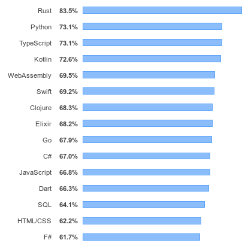
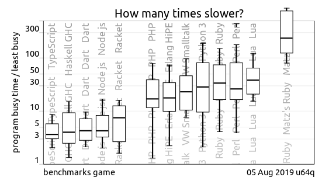
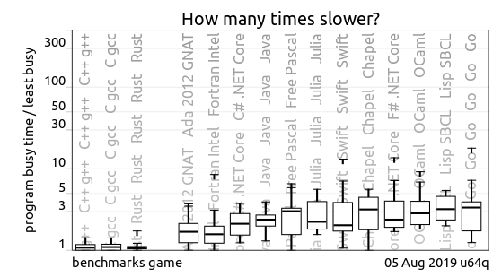
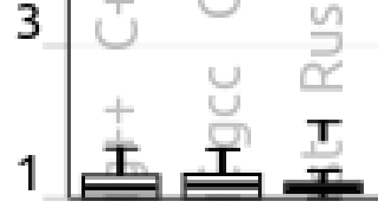
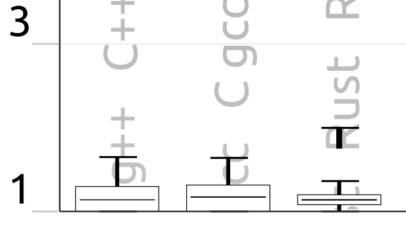

class: center, middle

## Why Rust?

---

## There's lots of love

.left[]

[src](https://insights.stackoverflow.com/survey/2019#technology-_-most-loved-dreaded-and-wanted-languages)

---

### Platform targets

-   CLI: Linux, MacOS, Windows
-   WebAssembly
-   Embedded devices:
    -   ARM Cortex-A/M/R
    -   RISC-V
    -   MSP430
    -   Embedded Linux
-   Operating systems (TockOS, Redox OS)

---

### Actively use Rust

-   Amazon (Firecracker)
-   Mozilla (Firefox, since 2016)
-   Dropbox (since 2016)
-   Brave browser
-   Intel developing [parity with C](https://hub.packtpub.com/rust-is-the-future-of-systems-programming-c-is-the-new-assembly-intel-principal-engineer-josh-triplett/)
-   Fire and Emergency NZ
-   Xero
-   CloudFlare <!-- (https://blog.cloudflare.com/cloudflare-workers-as-a-serverless-rust-platform/)-->
-   Most Blockchain companies: Centrality, Libra, etc

<!-- src: https://www.rust-lang.org/production/users -->

???

-   Talk about allowing Linux Kernel drivers to use Rust

---

## Rust's Goals

1. Safety
2. Speed
3. Concurrency

???

-   Trifector of goals.
-   Let's explore each goal.

---

## #1 Saftey!

_"70% of all Microsoft patches are for memory-related bugs"_

[Matt Miller, Microsoft](https://www.zdnet.com/article/microsoft-to-explore-using-rust/)

???

-   I think examples serve well here.
-   This is typical of security related bugs.
-   MS has been looking for safer C/C++ languages for a long time.
-   Heartbleed is an example, it was discovered in 2014 and caused all websites using OpenSSL to be vulnerable to expose senestive information.

---

## #2 Speed

Benchmarks Game:

-   10 toy benchmark programs.
-   it's a game, with ballpark figures.
-   Show "how many times slower" a program is.

---

## #2 Speed

.left[]

[src](https://benchmarksgame-team.pages.debian.net/benchmarksgame/which-programs-are-fastest.html)

???

-   Rust is in the same ballpark as C/C++. C is universally accepted as the fastest popular programming language.

---

## #2 Speed

.left[]

[src](https://benchmarksgame-team.pages.debian.net/benchmarksgame/which-programs-are-fastest.html)

???

-   Enlarge

---

## #2 Speed

.left[]

[src](https://benchmarksgame-team.pages.debian.net/benchmarksgame/which-programs-are-fastest.html)

???

-   Enhance

---

## #2 Speed

.left[]

[src](https://benchmarksgame-team.pages.debian.net/benchmarksgame/which-programs-are-fastest.html)

---

## But does performance matter?

???

-   Computers are getting faster, right!?
-   Not quite, let's have a look

---

### Clock cycles have peaked

.left[]

???

-   1984 - IBM XT 4.77 MHz
-   Look at that curve, what it be like in 2020 if it never stopped increasing.

---

### Single core perf slowing

.left[]

???

-   Single threaded performance improving slowly.
-   CPUs are getting more complex.

---

### Performance does matter!

???

-   Let's have a look at some Rust performance examples.

---

## Example

_"I ported a small API from Node.js to Rust and was blown away by the difference"_

[src](https://www.reddit.com/r/rust/comments/aw94xp/i_ported_a_small_api_from_nodejs_to_rust_and_was/)

---

background-image: url(img/ProductionDeployment-CPU.png)

???

-   See that CPU usage decreases from about 115% down to 15%.

---

background-image: url(img/ProductionDeployment-Mem.png)

???

-   Similar goes for memory.
-   It's surprising how well Node.js manages memory.
-   There are many such examples.

---

## #3 Concurrency

Concurrency in Rust:

-   Lightweight threads don't share heap memory
-   Use channels, mutexes, atomic primitives
-   The type system avoids all data races

???

-   If you want safety and concurrency, Rust beats all other languages, hands down.

---

## Rust makes concurrency simple

-   Concurrency in other languages is difficult
    -   Memory leaks
    -   Weird bugs
-   Rust: fearless concurrency

???

-   `valgrind` anyone?

---

## Examples

-   Google Chrome: 2x C++ re-writes - failed
-   Opera: Presto C++ re-write - failed
-   Firefox: 2x C++ re-write attempts - success with Rust
-   Brave Browser: Re-write from C++ to Rust, _"69x faster on average"_

???

-   Google Chrome:

    -   attempted multiple refactors of C/C++ layout(?) engine.
    -   Gave up, they are not using Rust.

-   Opera - presto engine
-   Mozilla Firefox:

    -   attempted CSS code refactor in 2009 and 2011, in C/C++.
    -   Achieved it in 2017 with Rust (Stylo).

-   Don't expect 69x speed improvement to be typical, it's more likely to have little or no improvement in performance.
-   It doesn't matter about the language

---

## Let's get started

???

-   Enough talk about Rust, where do you start?
-   What does it look and fell like?

---

## Getting Started

-   Go to https://rustup.rs/

    -   Linux/MacOS: `curl -sSf https://sh.rustup.rs | sh`
    -   Windows: [rustup.rs/](https://rustup.rs)

-   https://areweideyet.com/
    -   Get your supported packages

---

### The compiler: `rustc`

hello.rs:

```Rust
fn main() {
  println!("Hello World");
}
```

Run the following commands

```sh
rustc hello.rs
./hello
```

---

### Cargo

-   Like npm, pip
-   Downloads your package’s dependencies from [crates.io](https://crates.io)
-   Builds your package
-   makes distributable packages
-   Publish your package to [crates.io](https://crates.io)

---

### Creating a new project and running it

```sh
cargo new demo
cargo build  # (Optional) - Creates the `target` folder
cargo run
```

???

-   Look at `target/debug/`: `demo` is 2.4 MB

---

## The basics

-   Variables and mutability
-   Data types
-   Functions
-   Comments
-   Control Flow

---

### The basics: Variables and Mutability

```Rust
fn main() {
    let x = 5;
    x += 1;
    println!("x: {}", x);
}
```

---

background-image: url(img/CompileError.png)

### The basics: Variables and Mutability

---

### The basics: Variables and Mutability

```Rust
fn main() {
    let mut x = 5;   // Happy compiler
    x += 1;
    println!("x: {}", x);
}
```

---

### The basics: Data Types

-   Implicit typing
-   Scalars: integer, float, boolean and character (Unicode Scalar Value)
-   Compound: tuple, array
-   Strings & vectors: in standard library

---

### The basics: Data Types

```Rust
fn main() {
    let x = 2.0; // f64 - implicit annotation
    let y: f32 = 3.0; // f32 - explicit annotation

    let heart_eyed_cat = '😻';
    let tup: (_, f64, u8) = ('a', 6.4, 1);
    let array: [u8; 5] = [1, 1, 2, 3, 5];

    // Resizable - on heap
    let string = String::from("I want some 🍕");   // UTF-8
    let vector = vec![1, 2, 3];
}
```

---

### The basics: Functions

```Rust
fn add_five(a: f32) -> f32 {
  a + 5.0
}

fn main() {
  let six = add_five(1.0);
  println!("{}", six);
}
```

---

### The basics: Comments

```Rust
// This is comment

/* This
   is
   a
   comment
   too */
```

---

### The basics: Conditionals

```Rust
fn main() {
    let number = 3;

    if number < 5 {
        println!("condition was true");
    } else {
        println!("condition was false");
    }
}
```

---

### The basics: Conditionals

```Rust
fn main() {
    let number = 3;

    // Won't compile: test needs to resolve to boolean
    if number {
        println!("number was three");
    }
}
```

```Text


```

---

### The basics: Conditionals

```Rust
fn main() {
    let number = 3;

    // Won't compile: test needs to resolve to boolean
    if number {
        println!("number was three");
    }
}
```

```Text
error[E0308]: mismatched types
 --> src/main.rs:4:8
  |
4 |     if number {
  |        ^^^^^^ expected bool, found integral variable
  |
  = note: expected type `bool`
             found type `{integer}`
```

---

### The basics: Conditionals

```Rust
// If returning a value
fn main() {
    let condition = true;
    let number = if condition {
        5
    } else {
        6
    };

    println!("The value of number is: {}", number);
}
```

---

### The basics: Conditionals

```Rust
// Matches
fn main() {
    let number = 11;

    match number {                        // Matches must be exhaustive
        1 => println!("One!"),
        2 | 3 | 5 | 7 | 11 => println!("This is a prime"),
        13..=19 => println!("More than 12"),
        _ => println!("Ain't special"),   // Default case
    }
}
```

---

### The basics: Conditionals

```Rust
// A loop
fn main() {
    loop {
        println!("again!");
    }
}
```

---

### The basics: Conditionals

```Rust
// Loop returing a value
fn main() {
    let mut counter = 0;

    let result = loop {
        counter += 1;

        if counter == 10 {
            break counter * 2;
        }
    };

    println!("The result is {}", result);
}
```

---

### The basics: Conditionals

```Rust
// While loop example
fn main() {
    let mut number = 3;

    while number != 0 {
        println!("{}!", number);

        number -= 1;
    }

    println!("LIFTOFF!!!");
}
```

---

### The basics: Conditionals

```Rust
// For loops too!
fn main() {
    // Ranges
    for number in 0..10 {
        println!("{}!", number);
    }

    // Iterators
    let a = [10, 20, 30, 40, 50];
    for element in a.into_iter() {
        println!("the value is: {}", element);
    }
}
```

---

## Phew... Questions so far?

---

## Ownership

Three rules of ownership:

-   Each value in Rust has a variable that’s called its owner.
-   There can only be one owner at a time.
-   When the owner goes out of scope, the value will be dropped.

---

## Ownership

```Rust
fn main() {
  let s = String::from("hello");
  println!("s: {}", s);

  let t = s;                        // The value in 's' is moved to 't'
  println!("t: {}", t);
}
```

---

## Ownership

```Rust
fn main() {
  let s = String::from("hello");
  println!("s: {}", s);

  let t = s;
  println!("t: {}, s: {}", t, s);  // 't' owns "hello" - what happens?
}
```

---

## Ownership

```Rust
fn main() {
  let s = String::from("hello");
  println!("s: {}", s);

  let t = s;
  println!("t: {}, s: {}", t, s);   // Won't compile
}
```

---

background-image: url(img/OwnershipError.png)

## Two types of values

---

## Ownership is Rust's magic sword

-   You get memory safe guarantees without a GC.
-   Elimitates data races accross threads.
-   You know what a function can do with it's arguments.
-   It's a new paradigm, so requires some effort to master.

**Questions so far?**

---

## Two types of values

```Rust
fn main() {
  // Copy values
  let a = 42;                       // Put on stack
  let b = a;                        // 'a' is copied to 'b'
  println!("a: {}, b: {}", a, b);

  // Move values
  let s = String::from("hello");    // Data is put on the heap
  let t = s;                        // 's' is moved to 't'
  println!("s: {}, t: {}", s, t);   // Won't compile
}
```

---

## Use `Copy` to make a copy

```Rust
fn main() {
  let s = String::from("hello");
  let t = s.clone();                // A deep copy of 's' is made
  println!("s: {}, t: {}", s, t);
}
```

---

## You can borrow values

```Rust
fn main() {
  let s = String::from("hello");
  let t = &s;                       // `t` borrows `s`
  println!("s: {}, t: {}", s, t);
}
```

---

## You can borrow values many times (immutably)

```Rust
fn main() {
  let s = String::from("hello");
  let t = &s;
  let u = &s;
  let v = &t;                       // `v` borrows `t`
  println!("{}, {}, {}, {}", s, t, u, v);
}
```

---

## You can borrow slices of values

```Rust
fn main() {
  let s = String::from("hello");
  let t = &s[0..3];                  // `t` borrows "hel" from `s`
  println!("s: {}, t: {}", s, t);    // "s: hello, t: hel"
}
```

---

### Questions?

---

### Further watching

-   [Rust: Putting Ownership to Use](https://www.youtube.com/watch?v=wXoY91w4Agk) (until 15:55)
-   [Intro to Rustlang (Ownership and Borrowing)](https://www.youtube.com/watch?v=y7iSQ3s_yms)
-   [Rust Concurrency Explained](https://youtu.be/Dbytx0ivH7Q?t=385) (from 6:25)

---

## Resources

-   Learning resources:

    -   [Official Rust book](https://doc.rust-lang.org/stable/book/)
    -   [The Embedded Rust Book](https://rust-embedded.github.io/book/)
    -   [codewars.com](https://www.codewars.com/) - Browser based
    -   [exercism.io](https://exercism.io/) - CLI based

---

## Rousources

-   Help:

    -   [Rust programming forum](https://users.rust-lang.org/)
    -   [Rust-AKL slack](https://rust-akl.slack.com/)

---

## Next Meetup

Next Meetup:

-   structs and traits
-   enums and pattern matching
-   error handling
-   testing

---

## The End

[.left[]](https://creativecommons.org/licenses/by-nc-sa/4.0/)

You are free to:

-   Share: copy and redistribute the material in any medium or format.
-   Adapt: remix, transform, and build upon the material.

The licensor cannot revoke these freedoms as long as you follow the license terms.
